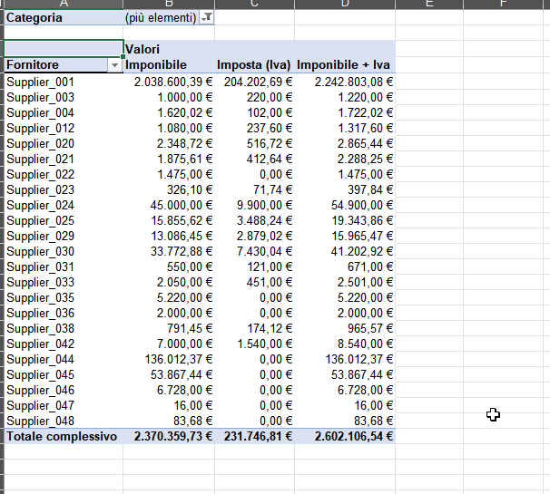

  

<h1 align="center">Pulizia e Reporting Dati in Excel – Costi Fornitori 2024–2025</h1>

  <b>Autore:</b> Marco Saccomandi  
   
  <b>Progetto:</b> Analisi e Dashboard di Reporting dei Costi Fornitori  
   
  <b>Strumenti:</b> Microsoft Excel · Power Query · Pulizia Dati · Tabelle Pivot  

---

##  Panoramica
Caso reale di workflow Excel focalizzato su **pulizia, fusione e automazione dei report dei costi fornitori** per un consorzio edilizio.  
Diversi file Excel non strutturati sono stati consolidati in un’unica **Fact Table** che alimenta dashboard pivot dinamiche e report stampabili.

---

##  Anteprima del Progetto
Una breve GIF mostra l’intero flusso di lavoro — dai dati grezzi ai dashboard finali in Excel.

  

---

##  Sintesi del Workflow

### Fase 1 – Consolidamento dei Dati Grezzi
I dati provenivano da quattro file Excel indipendenti (Fatture, Fornitori, Costi Extra e Acquisti) senza chiavi comuni.  
Sono stati standardizzati e rinominati per consentire la fusione.

| Immagine | Descrizione |
|-----------|-------------|
|  | Panoramica della cartella con i file originali Excel. |
|  | Dati fatture 2024–2025 con formati incoerenti. |
|  | Riepilogo fornitori non strutturato. |
|  | Foglio dei costi extra (utenze, stipendi, tasse). |
|  | Dataset aggiuntivo 2025 per validazione. |

---

### Fase 2 – Pulizia e Fusione dei Dati
Tutte le sorgenti sono state unite in una **Fact Table** contenente campi normalizzati:  
Anno, Categoria, Sottocategoria e Incidenza %.

| Immagine | Descrizione |
|-----------|-------------|
|  | Primo test di fusione tra dataset costi e fatture. |
|  | Fact Table di base con campi standardizzati. |
|  | Versione raffinata con classificazione e logiche di validazione. |

---

### Fase 3 – Reporting e Analisi
Sono state create tabelle pivot dinamiche per riepilogare e analizzare i dati di fornitori e centri di costo.

| Immagine | Descrizione |
|-----------|-------------|
|  | Dashboard di aggregazione per centro di costo. |
|  | Dettaglio fornitore per documento. |
|  | Esempio di report stampabile filtrato finale. |

---

##  Strumenti e Tecniche
- **Microsoft Excel 365** – ambiente principale  
- **Power Query** – fusione e normalizzazione  
- **Tabelle Pivot** – dashboard automatizzate  
- **Formattazione condizionale** – evidenziazione e validazione  
- **Normalizzazione manuale** – pulizia categorie e fornitori  
- **Python (OpenPyXL)** – utilizzato per anonimizzare i nomi dei fornitori nel file finale

---

##  Risultati
✔ 4 file Excel frammentati uniti in una Fact Table unica  
✔ Report pivot completamente automatizzati per fornitori e categorie  
✔ Struttura annuale standardizzata per il monitoraggio dei costi  
✔ Sessione di formazione di **2 ore** per il personale amministrativo  
✔ Maggiore autonomia per utenti non tecnici nella creazione dei report  

---

##  Download del File Demo
Puoi esplorare la versione anonimizzata del file Excel utilizzato nel progetto qui:  
📂 [**Scarica SupplierTabRealCase.xlsx**](./assets/SupplierTabRealCase.xlsx)

---

##  Nota sulla Privacy
Questo progetto è stato sviluppato con **dati operativi reali** di un consorzio edilizio.  
Tutti i nomi dei fornitori e le informazioni identificabili sono stati **anonimizzati** nella versione pubblica  
per garantire la conformità alle normative sulla privacy e la riservatezza dei dati.

---

**Autore:** Marco Saccomandi  
Progetto: *Analisi Costi Fornitori 2024–2025*  
Focus: *Pulizia Dati, Automazione dei Report e Formazione Utente*

---

**Lettura consigliata:**  
Consulta il [Case Summary](CASE_SUMMARY_IT.md) per contesto, azioni e risultati.
