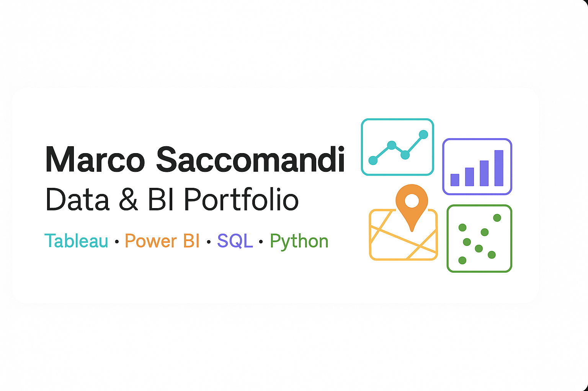
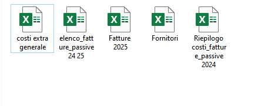
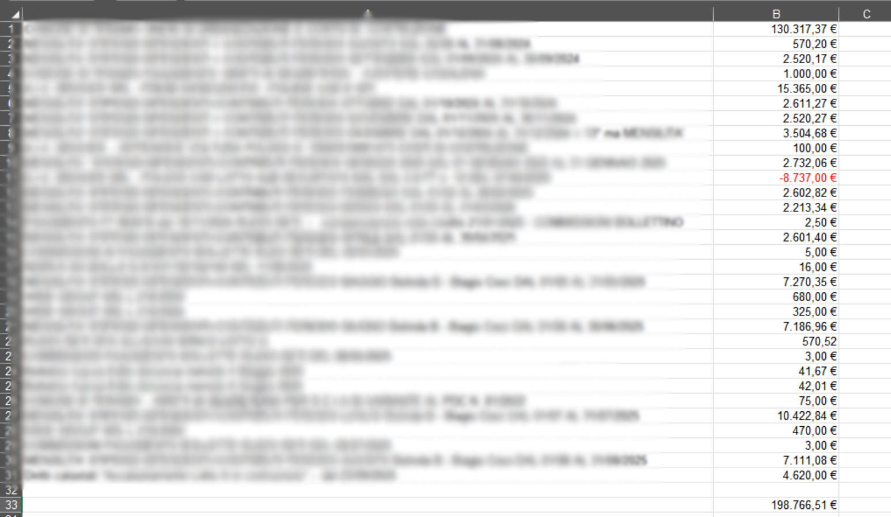
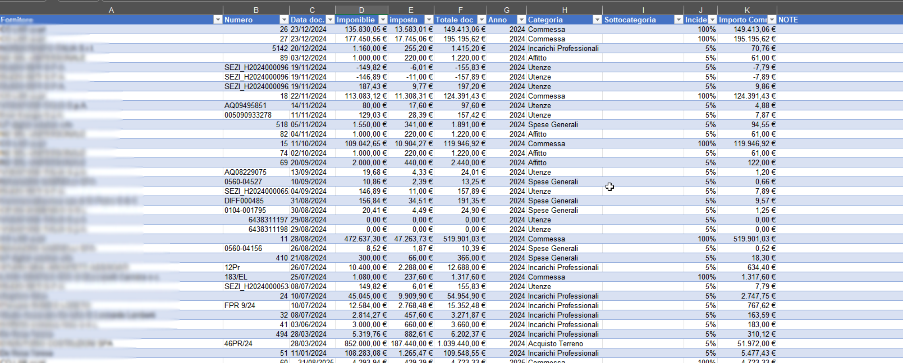
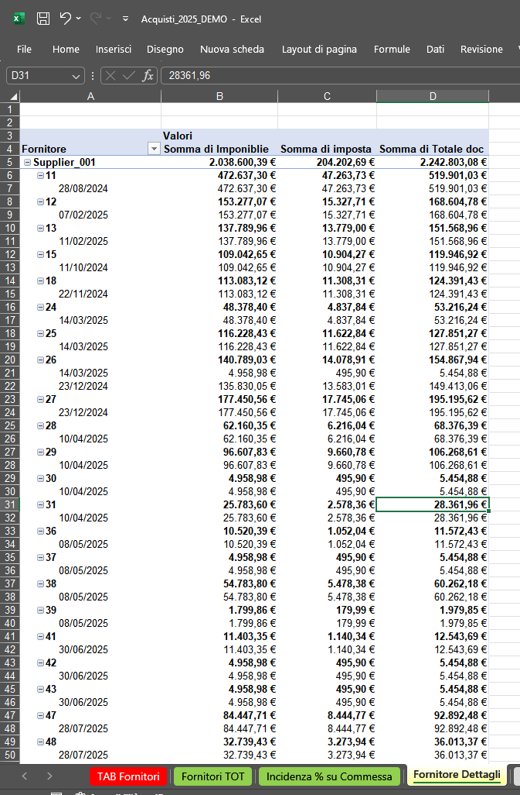
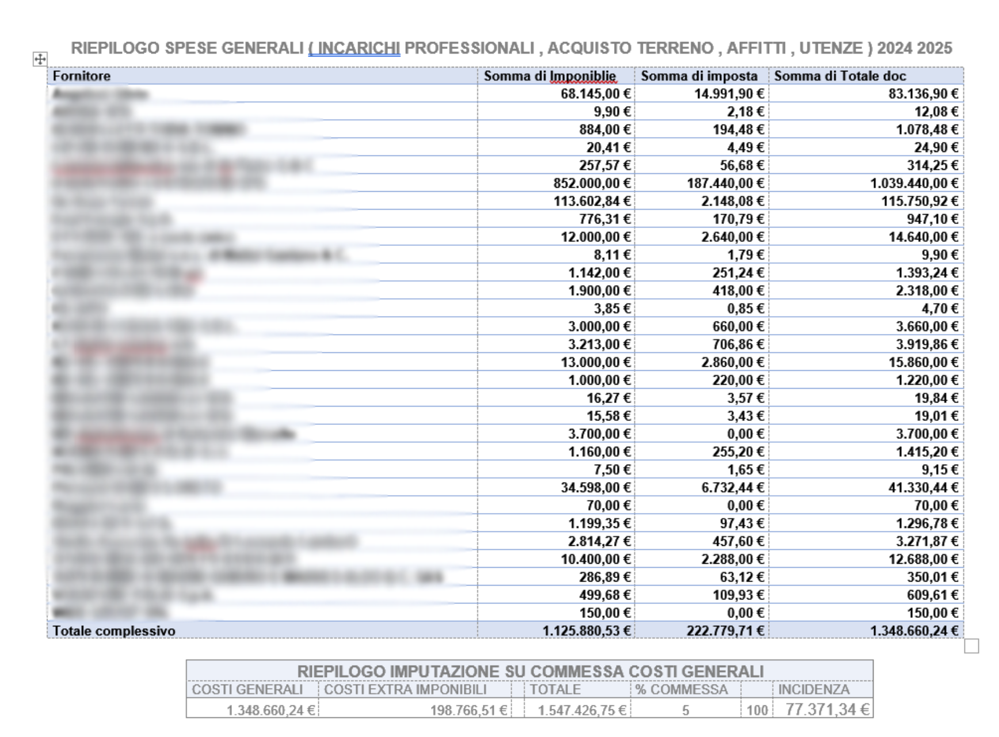

  

<h1 align="center">Excel Data Cleaning & Reporting – Supplier Costs 2024–2025</h1>

  <b>Author:</b> Marco Saccomandi  
   
  <b>Project:</b> Supplier Cost Analysis and Reporting Dashboard  
   
  <b>Tools:</b> Microsoft Excel · Power Query · Data Cleaning · Pivot Tables  

---

##  Overview
A real-case Excel workflow focused on **cleaning, merging, and automating supplier cost reports** for a construction consortium.  
Multiple unstructured Excel files were consolidated into a single **Fact Table**, powering dynamic pivot dashboards and printable financial summaries.

---

##  Project GIF Overview
A short GIF showcasing the full workflow — from raw data to final Excel dashboards.

  

---

##  Workflow Summary

### Step 1 – Raw Data Consolidation
Raw data came from four independent Excel files (Invoices, Suppliers, Extra Costs, and Purchases) with no shared keys.  
They were standardized and renamed for merge.

| Image | Description |
|--------|--------------|
|  | Folder overview with original Excel files. |
|  | Raw invoice data (2024–2025) with inconsistent formats. |
|  | Unstructured supplier purchase summary. |
|  | Extra cost sheet (utilities, salaries, taxes). |
|  | Additional 2025 dataset for validation. |

---

### Step 2 – Data Cleaning & Merge
All cleaned sources were merged into a single **Fact Table** containing normalized fields:  
Year, Category, Subcategory, and Incidence %.

| Image | Description |
|--------|--------------|
|  | First merge test between cost and invoice datasets. |
|  | Base Fact Table with standardized fields. |
|  | Refined version with cost classification and validation logic. |

---

### Step 3 – Reporting & Analysis
Dynamic pivot tables were implemented to summarize and analyze supplier and cost data.

| Image | Description |
|--------|--------------|
|  | Cost center aggregation dashboard. |
|  | Supplier detail breakdown by document. |
|  | Example of final printable summary report. |

---

##  Download the Demo File
You can explore the anonymized Excel version used in this project here:  
📂 [**Download SupplierTabRealCase.xlsx**](./assets/SupplierTabRealCase.xlsx)

---

##  Privacy Note
This project was built using **real operational data** from a construction consortium.  
All supplier names and identifiable information were **anonymized** in the public version  
to ensure full compliance with privacy and data protection requirements.

---

##  Tools & Techniques
- **Microsoft Excel 365** – main environment  
- **Power Query** – merge and normalization  
- **Pivot Tables** – automated dashboards  
- **Conditional Formatting** – highlighting and validation  
- **Manual normalization** – supplier and category cleanup
- **Python (OpenPyXL)** – used to anonymize supplier names in the final Excel file
---

##  Results
✔ 4 fragmented Excel files merged into 1 unified Fact Table  
✔ Fully automated pivot reports for suppliers and categories  
✔ Standardized year-to-year structure for cost tracking  
✔ 2-hour training session provided to the administrative staff  
✔ Enabled autonomy for non-technical users in Excel report generation  

---

##  Author
**Marco Saccomandi**  
Project: *Supplier Cost Analysis 2024–2025*  
Focus: *Data Cleaning, Reporting Automation, and User Training*

---

**Further reading:**  
See the full [Case Summary](CASE_SUMMARY.md) for context, actions, and impact.
