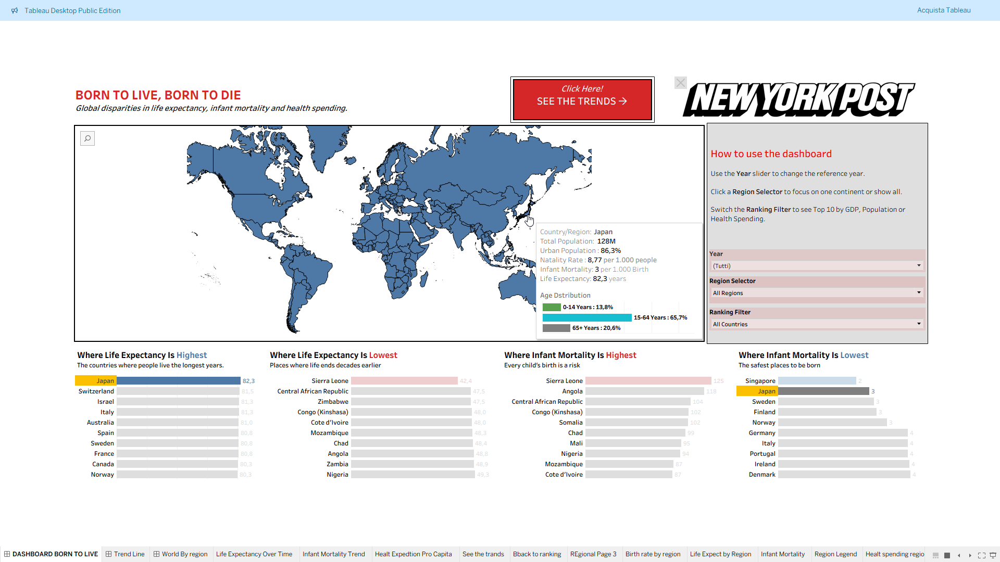
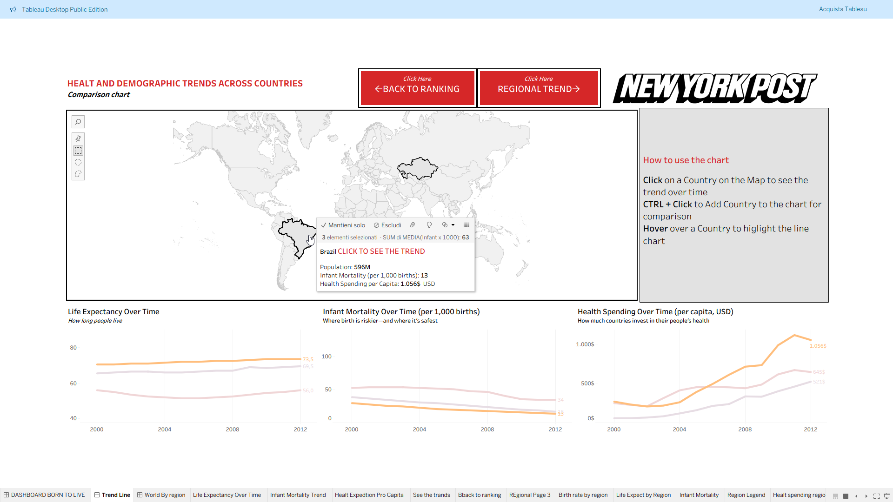
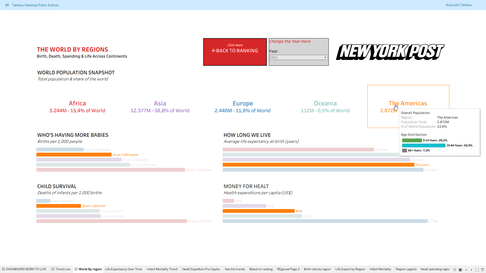
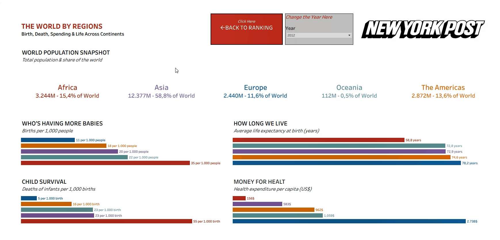

#  ** Born to Live, Born to Die — Global Health & Demographic Inequality **

📁 [Download Tableau Workbook (.twbx)](born-to-live-born-to-die.twbx) ( You'll need Tableau to open it , go down on the page for the Tableau public link)

**Overview**  
An interactive Tableau dashboard exploring *global disparities in life expectancy, infant mortality, and healthcare spending*.  
Designed with a **tabloid / New York Post** style to make data visually engaging and easy to navigate.

---

##  **Dashboard Structure**
 

###  **Page 1 — Health & Mortality Overview ** 
- Interactive world map showing **life expectancy** and **infant mortality**.  
- Dynamic **ranking filters** (Top 10 by GDP, Population, or Health Expenditure).  
- Clear UI instructions for accessibility and guided exploration.

###  **Page 2 — Trends Over Time  **
- Multi-country comparison of **life expectancy**, **infant mortality**, and **health spending per capita**.  
- Highlights **long-term health progress** and inequality trends.

###  ** Page 3 — Regional Snapshot  **
- KPIs by region (Population %, Life Expectancy, Birth Rate, Health Spending).  
- Continental comparison for a global perspective.

---

##  ** Insights**
- Higher healthcare spending correlates with higher life expectancy.  
- Global infant mortality rates have improved, but regional gaps remain wide.  
- Africa and Asia show slower progress compared to Europe and Oceania.

---

##  ** Tools & Skills**
- Tableau Desktop  
- Data blending, filters, parameters, and calculated fields  
- UX design, layout composition, storytelling  
- Dataset: *World Bank – Global Health and Demographics Indicators (2000–2015)*

---

##  ** Screenshots**
| Page | Preview |
|------|----------|
| Global Overview |  |
| Trend Comparison |  |
| Regional Summary |  |

---

##  ** Dashboard Previews**

A quick look at the interactive dashboards from **Born to Live, Born to Die**.

| Global Overview | Trend Comparision | Regional Summary |
|------------------|----------------|------------------|
|  |  |  |

Each GIF shows key interactions:
- **Global Overview:** world rankings, tooltips, and filters in action.  
- **Trend Comparison:** country comparison and temporal analysis.  
- **Regional Summary:** demographic distribution and interactivity by continent.

---

 **View the interactive dashboard on Tableau Public:**  
 [Born to Live, Born to Die – Tabloid Style Dashboard on Global Health](https://public.tableau.com/app/profile/marco.saccomandi/viz/BorntoLiveBorntoDie-TabloidStyleDashboardonGlobalHealt/DASHBOARDBORNTOLIVE)

---

##  ** Summary**

A creative, multi-page Tableau dashboard that merges **data analysis** and **visual storytelling** — turning demographic statistics into an engaging educational narrative.
