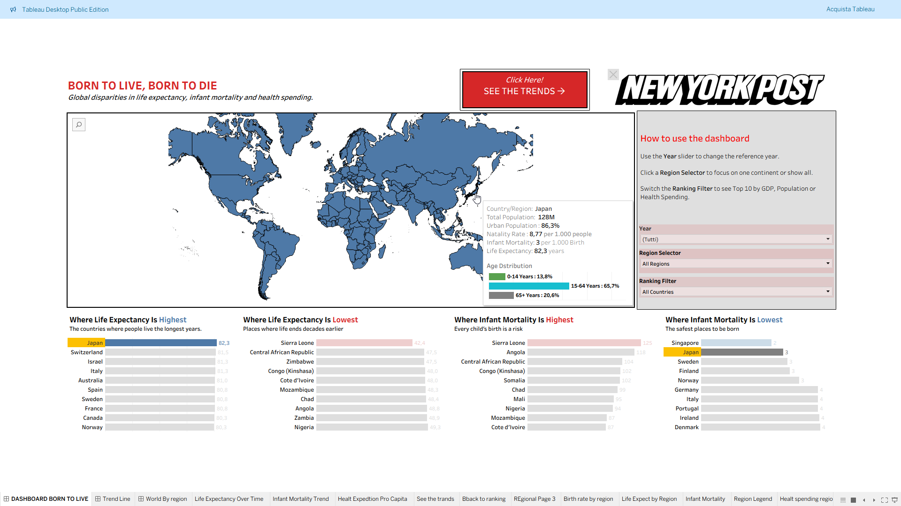
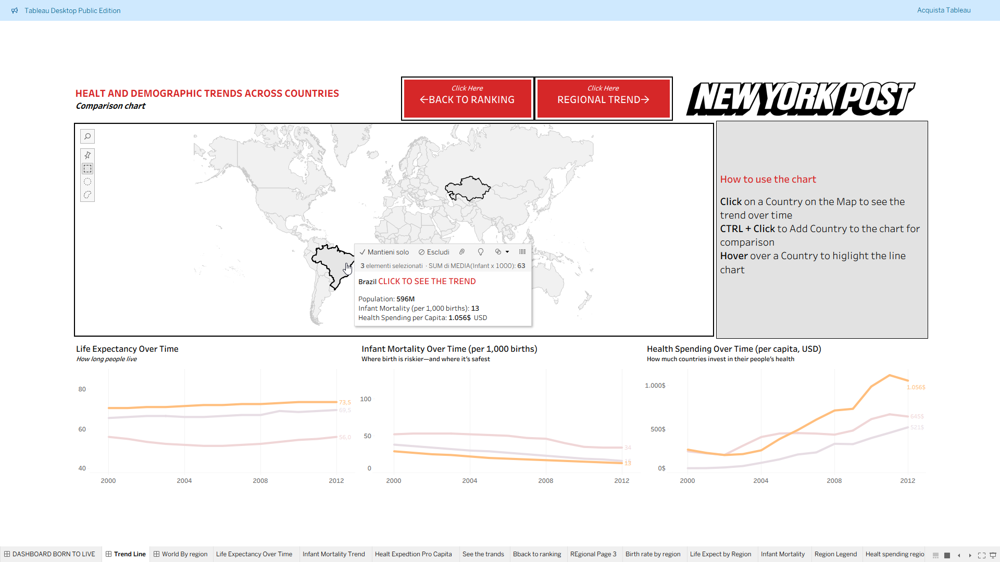
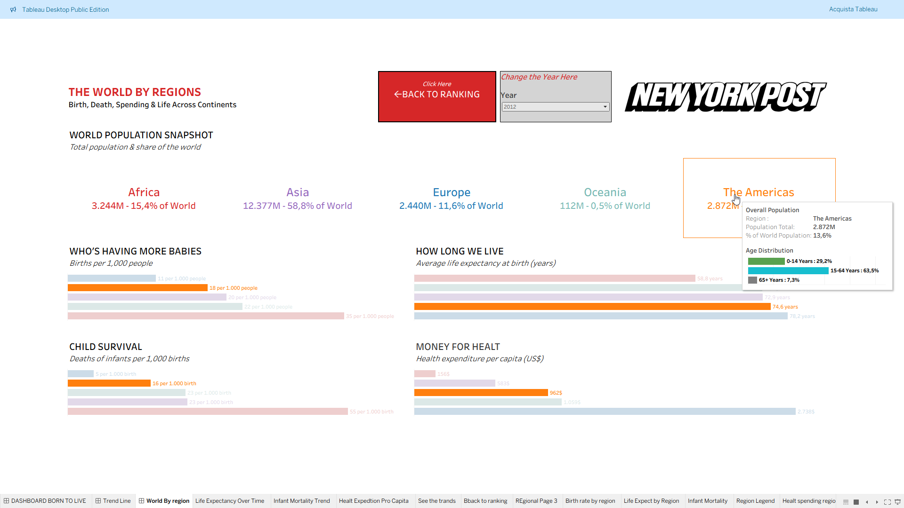
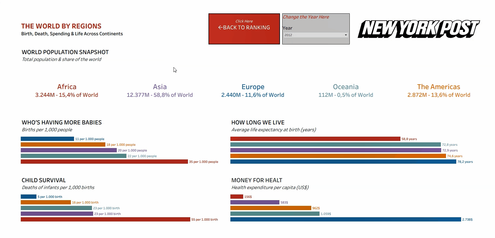

#   Born to Live, Born to Die — Global Health & Demographic Inequality 

📁 [Download Tableau Workbook (.twbx)](born-to-live-born-to-die.twbx) ( You'll need Tableau to open it , go down on the page for the Tableau public link)

**Overview**  
An interactive Tableau dashboard exploring how life expectancy, infant mortality, and healthcare spending reveal deep global inequalities.
The goal is to turn demographic statistics into something visual, readable, and emotionally clear.

Designed in a tabloid / New York Post style — bold, accessible, and intuitive — this dashboard shows that even complex health data can be told like a story.
Each page answers a key question: Who lives longer? Where do inequalities persist? And how does money shape our chances of survival?

---

##  **Dashboard Structure**
 

###  **Page 1 — Health & Mortality Overview ** 
A global view of life expectancy and infant mortality.
Interactive world map with tooltip details for each country
Dynamic ranking filters (Top 10 by GDP, Population, or Health Expenditure)
Simple layout and clear exploration guide
**Key takeaway: richer countries tend to live longer — but exceptions reveal where inequality meets policy.**

###  **Page 2 — Trends Over Time  **
Shows long-term evolution of health indicators.
Multi-country line charts for life expectancy, infant mortality, and health spending per capita
Select and compare countries from 2000 to 2015
**Insight: progress is real, but the global gap hasn’t fully closed.**

###  ** Page 3 — Regional Snapshot  **
Regional KPIs for a comparative global view.
Population %, Life Expectancy, Birth Rate, Health Spending
Color-coded visuals and bar comparisons
**Highlight: Africa and Asia move forward, but inequality remains visible.**

---

##  ** Insights**
- Higher healthcare spending correlates with higher life expectancy.  
- Global infant mortality rates have improved, but regional gaps remain wide.  
- Africa and Asia show slower progress compared to Europe and Oceania.

---

##  ** Tools & Skills**
Tableau Desktop
Excel / Data Blending
UX Layout & Color Design
Storytelling through Data Visualization
**Dataset: World Bank – Global Health and Demographics Indicators (2000–2015)**

---

##  ** Screenshots**
| Page | Preview |
|------|----------|
| Global Overview |  |
| Trend Comparison |  |
| Regional Summary |  |

---

##  ** Dashboard Previews**

A quick look at the interactive dashboards from **Born to Live, Born to Die**.

| Global Overview | Trend Comparision | Regional Summary |
|------------------|----------------|------------------|
|  |  |  |

Each GIF shows key interactions:
- **Global Overview:** world rankings, tooltips, and filters in action.  
- **Trend Comparison:** country comparison and temporal analysis.  
- **Regional Summary:** demographic distribution and interactivity by continent.

---
 **View the interactive dashboard on Tableau Public:**  
 [Born to Live, Born to Die – Tabloid Style Dashboard on Global Health](https://public.tableau.com/app/profile/marco.saccomandi/viz/BorntoLiveBorntoDie-TabloidStyleDashboardonGlobalHealt/DASHBOARDBORNTOLIVE)

---

##  ** Summary**

A multi-page Tableau dashboard blending data analysis and visual storytelling, turning global health statistics into an educational narrative.
|Behind every data point, there’s a story about who gets to live longer — and why.|

---
---

**DESCRIZIONE**

Una dashboard interattiva che esplora le disuguaglianze globali di salute attraverso dati su aspettativa di vita, mortalità infantile e spesa sanitaria.

Progettata in uno stile tabloid per rendere i numeri immediati, leggibili e visivamente d’impatto.

Ogni pagina risponde a una domanda chiave: chi vive più a lungo, dove e perché?

Un progetto che unisce analisi, design e storytelling per mostrare che dietro ogni dato c’è una storia umana.

|Dietro ogni numero c’è una storia su chi riesce a vivere più a lungo — e sul perché.

**Pagina 1 — Health & Mortality Overview**

Una panoramica globale di aspettativa di vita e mortalità infantile.

Mappa interattiva con dettagli per ogni paese

Filtri dinamici (Top 10 per PIL, popolazione o spesa sanitaria)

Interfaccia chiara e istruzioni per l’esplorazione

**Messaggio chiave: i paesi più ricchi vivono più a lungo, ma le eccezioni mostrano dove disuguaglianze e politiche si incontrano.**

**Pagina 2 — Trends Over Time**

Una visione temporale per confrontare l’evoluzione dei sistemi sanitari nel tempo.

Grafici multi-paese su aspettativa di vita, mortalità infantile e spesa sanitaria pro capite

Possibilità di selezionare singoli paesi e confrontarli tra il 2000 e il 2015

**Insight: quasi tutti i paesi migliorano, ma la distanza tra i migliori e i peggiori resta ampia.**

**Pagina 3 — Regional Snapshot**

Un confronto continentale basato su indicatori sintetici.

KPI per regione: % Popolazione, Aspettativa di vita, Tasso di natalità, Spesa sanitaria

Visualizzazione a colori e barre comparative per un colpo d’occhio immediato

**Highlight: Africa e Asia avanzano lentamente ma costantemente — il progresso globale non è ancora equamente distribuito.**

**Strumenti e Competenze**

Tableau Desktop — design, interattività e calculated fields

Excel / Data Blending — preparazione dataset (World Bank Indicators)

UX Design e Composizione Layout — leggibilità e palette coerente

Data Storytelling — narrazione visiva basata su dati

**Dataset: World Bank – Global Health and Demographics Indicators (2000–2015)**
